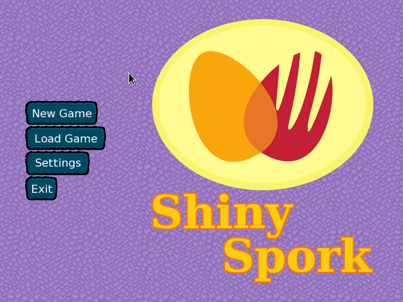
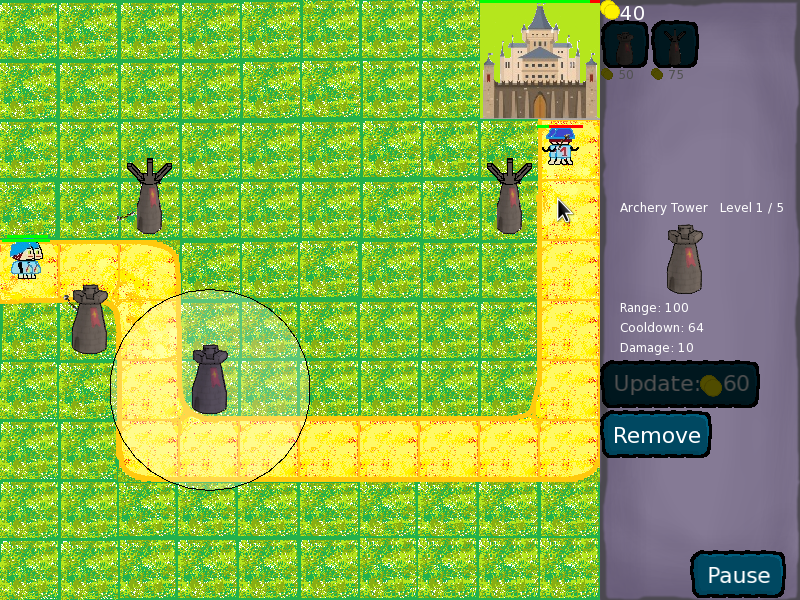
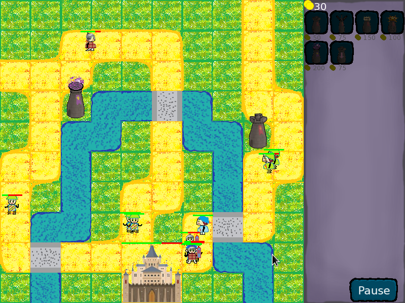
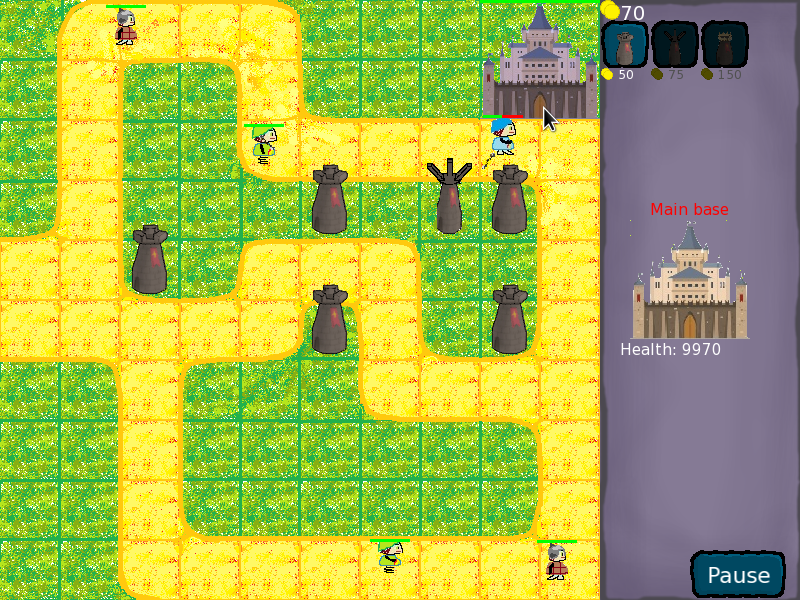
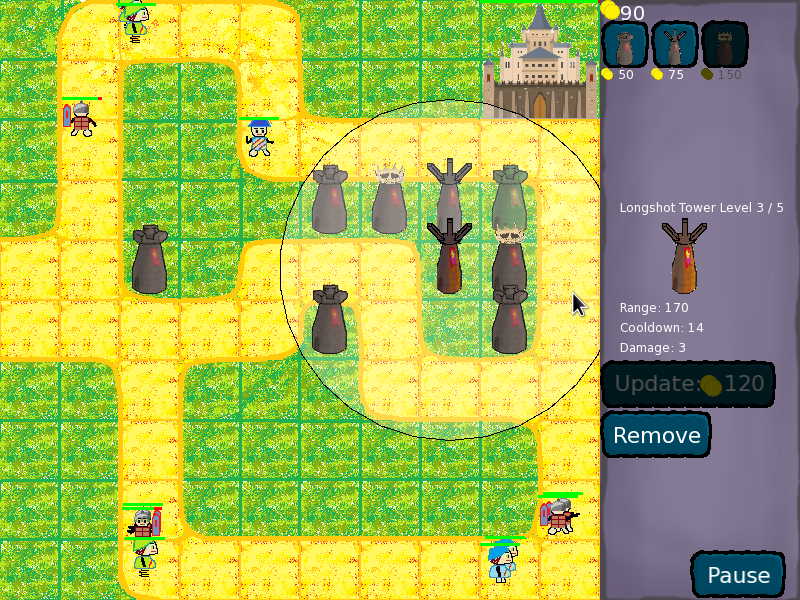
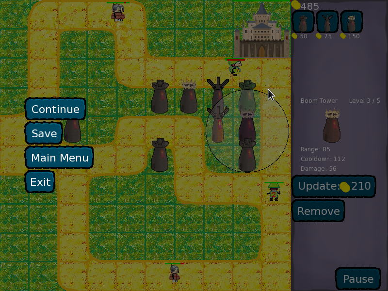

# Shiny Spork

**Shiny Spork** - это игра в жанре tower defense, написанная на C++ с использованием библиотеки SFML.

Проект является учебным и разрабатывался командой из четырёх студентов первого курса ФПМИ БГУ:

 - [Комаров Александр](https://github.com/Alexthunder2)
 - [Сечко Никита](https://github.com/Nicksechko)
 - [Титенок Станислав](https://github.com/xtsm)
 - [Шляго Никита](https://github.com/nikkita1267)

На момент написания никто (кажется) из нас ни разу не писал что-то длиннее пятисот строчек,
тем более в команде.
Это отразилось на качестве кода, так что перед погружением в исходники советую надеть костюм
химзащиты и помолиться.

## Сборка

Сборка производится с помощью CMake. Убедитесь, что CMake имеет доступ к SFML.

В простейшем случае для сборки проекта достаточно выполнить следующие команды в корне репозитория:

    cmake ./
    make

В случае необходимости установки в другой каталог в него, помимо исполняемого файла
нужно будет скопировать каталог ```assets/```.

Также вы можете воспользоваться **бинарными сборками** под Windows и Linux.

## Скриншоты






